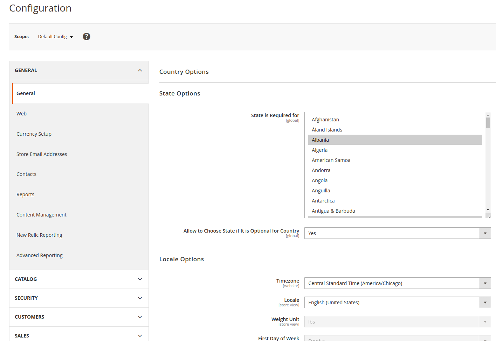
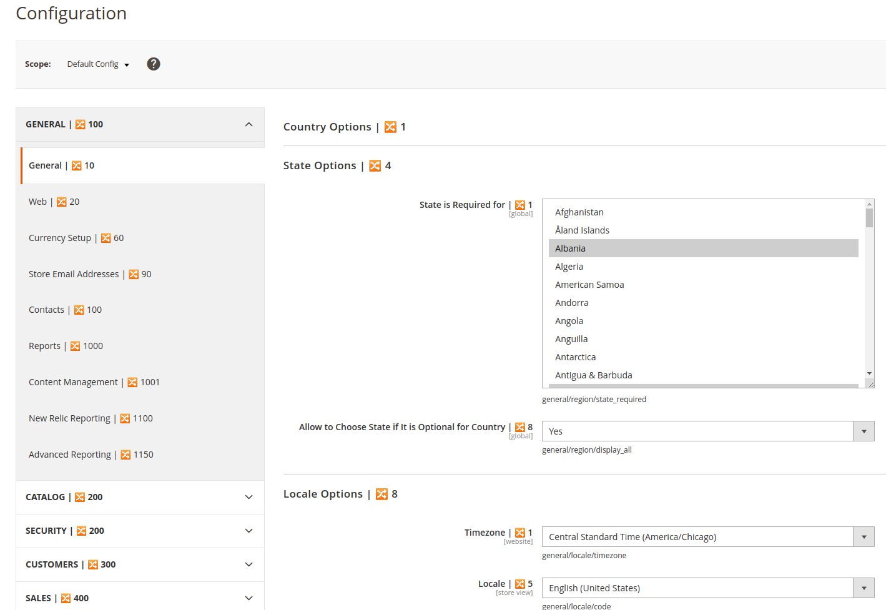
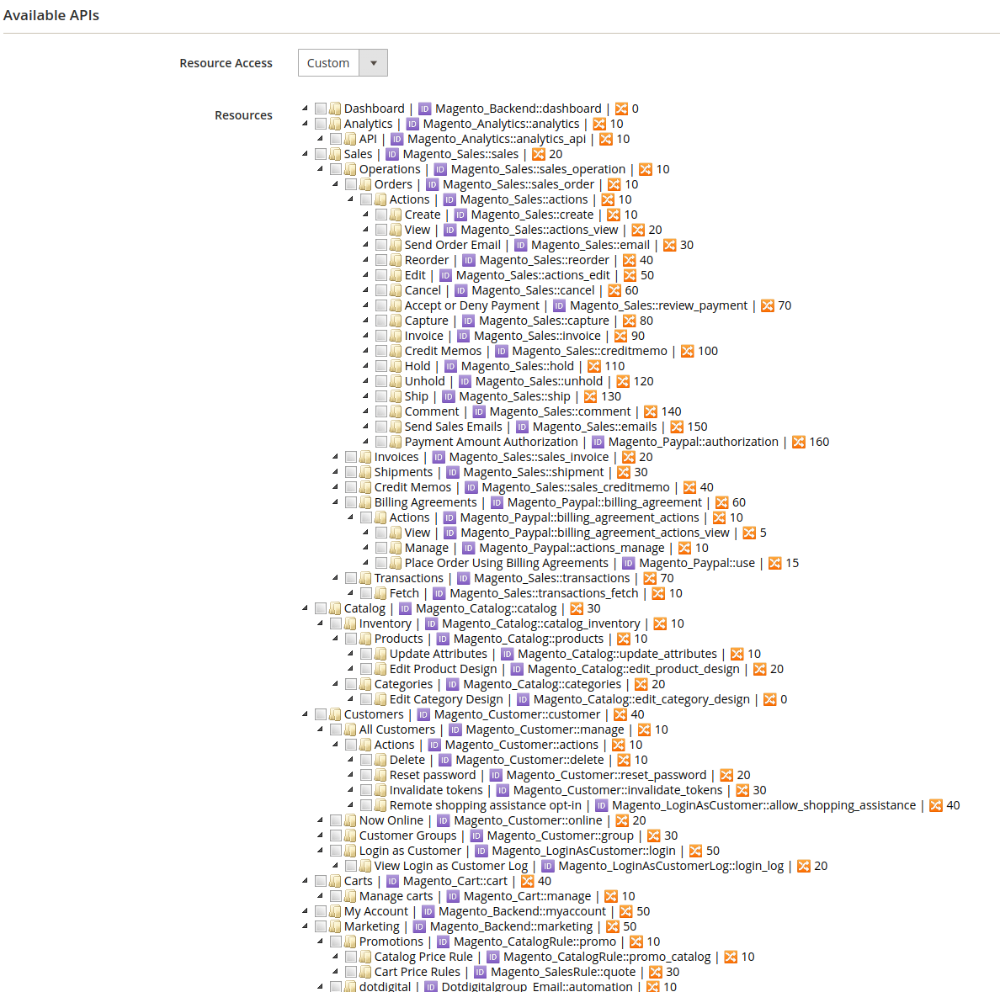

# System Configuration Toolkit

System Configuration Toolkit is a Magento 2 module that shows sort order of system configuration's tabs, sections, groups, and fields. 

It also helps you to see full field paths, so no more looking for those.

**Disclaimer:** System Configuration Toolkit sole purpose is to speed up the process of adding new System Configuration during development.

There is no use case for live / production environments, and this module shouldn't really be installed there.

## Installation
```
composer require --dev pragmatic-modules/magento2-module-system-configuration-toolkit
bin/magento module:enable Pragmatic_SystemConfigurationToolkit
bin/magento setup:upgrade
```

## Configuration

In order to module take effect you have to enable it through 

`Store > Configuration > Pragmatic Modules > System Configuration Toolkit > General > Enable`

You can enable functionalities separately to display

1. sort orders of tabs, sections, groups, and fields
2. field full path
3. ACL Resource sort fields and IDs

Once you enable it, you have to clear `config` cache type by running `bin/magento cache:clean config`

## Problem

It is quite common to add new system configurations for custom modules during development. 

To do that, you have to determine *where* it should be displayed through adjusting `sortOrder` to the value that's in between the already existing tabs, and sections. 

You can find sort orders in `system.xml` but because each module has its own separate `system.xml` it becomes a pain to find proper sort order of tabs and sections. The same problem applies to any adjustments to the existing system configuration. 

When your job is to add a new field(s) to an existing group below some other field it can become a guessing game, sort order flipping, and cache refreshing, until the field finally lands where it is supposed to be.

## Solution

System Configuration Toolkit module that will help save you time that you would normally spend on looking for `system.xml` sort orders or full paths.


## How It Looks

#### Before:



#### After:





## How It Works

System Configuration Toolkit is using two plugins: (1) for sort orders that are appended into the tabs, sections, groups, and field labels, (2) for field paths that are appended into field comment

## Changelog

v.1.1.2 Copy to clipboard (thanks to [@mehdichaouch](https://github.com/mehdichaouch))

v.1.1.1 bugfix

v.1.1.0 ACL Resources sort order, and IDs

v.1.0.0 initial release
* sort orders of tabs, sections, groups, and fields
* field full path
